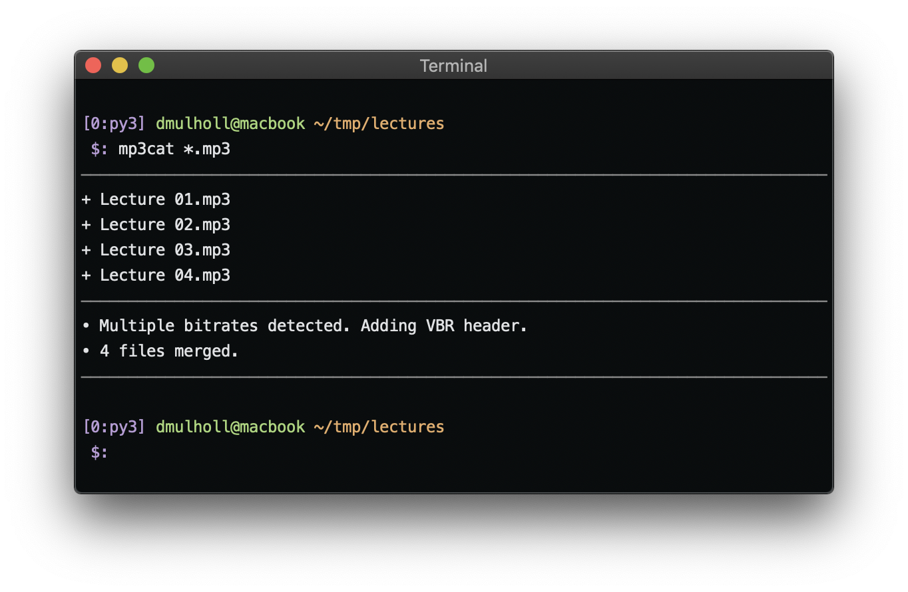

# MP3Cat

[documentation]: http://www.dmulholl.com/dev/mp3cat.html
[releases]: https://github.com/dmulholl/mp3cat/releases
[mp3binder]: https://github.com/crra/mp3binder

MP3Cat is a simple command line utility for concatenating MP3 files without re-encoding.

    

* [Documentation][]
* [Pre-built Binaries][releases]

This application is in *maintenance mode* &mdash; it's intentionally simple and I'm not planning to add any extra features.
If you need something more complex check out [mp3binder][] which is an active fork with additional functionality.
